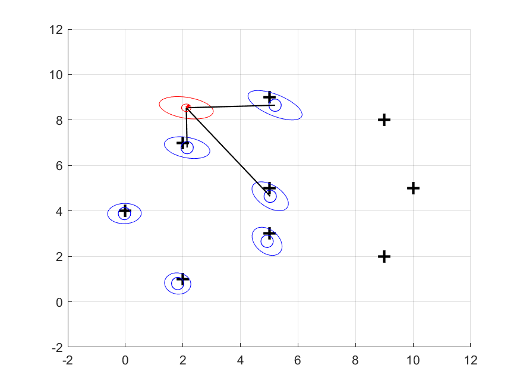

## Extended-Kalman-Filter based Landmark SLAM in MATLAB

This repository contains a simple EKF SLAM in matlab.
- motion model: odometry model
- observation: a range-sensor like readings(range/angle) of each landmark with associations given.
  



### How to run
you can run the code on the provided matlab livescript.
```
hw4_EKFSLAM.mlx
```

