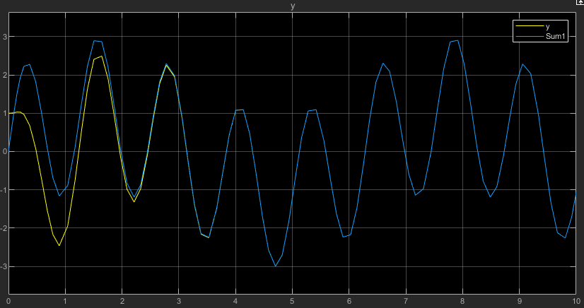

## State Space Tracking Control using Normal Form and observer

This repository implements a SISO state-space controller that tracks an input, using an observer. The plant is a simple two-carts system held together with a spring.

* model image from MATLAB

Since not the entire state space, but only the position of the second cart is observed, I implemented an observer.

Blue - Input to track \
Yellow - Output, starting from rest at x=1m
  

### Dependencies
You'll need matlab with control systems toolbox or signal processing toolbox installed. Also, you'll need simulink.