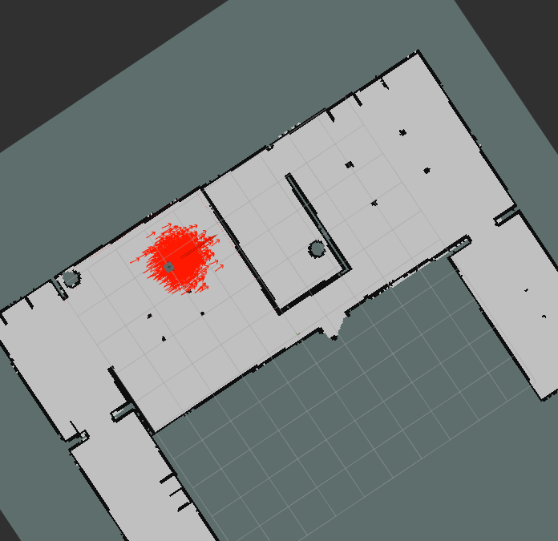
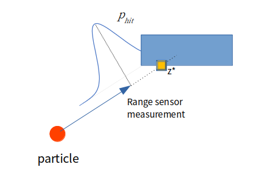

## particle_filter_project

This repository implements the monte-carlo localization algorithm
for the Turtlebot3 equipped with a 360-degree range sensor
  



In addition to the original requirements, I have varied the number of particles over time, starting from a large number to allow global localization and then scaling down by halves for speedup.

- sensor model: likelihood field

    weights each particle by the likelihood of actual laser measurement given the particle's expectation of the measurement, calculated from its location and the (known)map.



### Dependencies
To run this code, you must have the turtlebot3 and its simulation package installed.
check this page for installation

https://emanual.robotis.com/docs/en/platform/turtlebot3/simulation/


Especially, you must install
- git clone https://github.com/ROBOTIS-GIT/turtlebot3_msgs.git
- git clone -b noetic-devel https://github.com/ROBOTIS-GIT/turtlebot3.git
- git clone https://github.com/ROBOTIS-GIT/turtlebot3_simulations.git


### How to run
To run the code, first start roscore
```
roscore
```

and start gazebo simulation
```
roslaunch turtlebot3_gazebo turtlebot3_house.launch
```

To see the particles with the map, use
```
roslaunch particle_filter_project visualize_particles.launch
```

And to operate the turtlebot
```
roslaunch turtlebot3_teleop turtlebot3_teleop_key.launch
```

Finally, the particle filter algorithm
```
rosrun particle_filter_project particle_filter.py
```

### issues

**In slow computers, the simulation may not run quickly enough and something like**
```
tf2.TransformException: Lookup would require extrapolation x.xxs into the past.
```
**may show up. Try to adjust the num_particles property.**